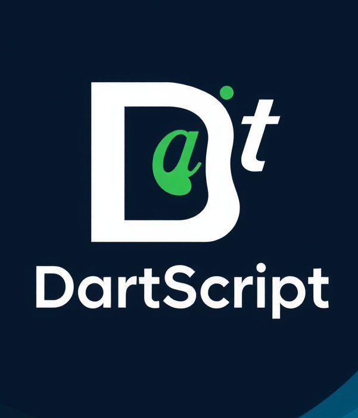

<div align="center">
   
</div>

# Language_DartScript
The Software-Defined Rubber Ducky. Write and execute BadUSB payloads with a simple 50-command syntax without spending hundreds on hardware.

```markdown
# 📌 DartScript  
### *The Software-Defined BadUSB Language*

[](https://github.com)
[](https://github.com)
[](LICENSE)
[](https://github.com)

DartScript is a **fast, interpreter‑based scripting language** built entirely in **C** for **Windows automation** and **security testing**.  
Write payloads with a clean **50‑command syntax** — no expensive hardware needed.

---

## 👤 About the Creator

| | |
|---|---|
| **Name** | Salman (18 years old) |
| **Country** | Iran 🇮🇷 |
| **Built with** | C (ANSI C) + AI assistance |
| **First release** | 2026 |

> *DartScript is a solo project — from the core interpreter to the standalone `.exe` compiler — made by a teenager passionate about low‑level programming and offensive security.*

---

## ⚡ Why DartScript?

|  | **USB Rubber Ducky** | **DartScript** |
|---|---|---|
| 💰 Hardware needed | Yes – $100+ | **No** |
| ⚡ Execution speed | Medium | **Fast (native C interpreter)** |
| ⌨️ Available commands | ~30 | **50+** |
| 📁 Script extension | `.txt` | **`.drs`** |
| 🧱 Compile to `.exe` | ❌ | **Yes** (AOT compiler included) |
| 📚 Learning difficulty | Medium | **Easy** |
| 🔓 Open source | ❌ | **Yes** – full source on GitHub |
| 🧑‍💻 Built by | Ducky Script : Hak5 Team | **DartScript : A single 18‑year‑old** |

---

## 🚀 Key Features

- **Pure C Interpreter** – minimal overhead, maximum raw speed.
- **50+ Commands** – keystroke injection, system control, file operations, logic, networking.
- **No Hardware Cost** – any Windows machine becomes a BadUSB device.
- **AOT Compiler** – turn `.drs` scripts into standalone `.exe` files.
- **Simple Syntax** – easy to learn, inspired by Ducky Script but more powerful.
- **Open Source** – the entire interpreter source is public on GitHub.
- **Windows Only (v1.0)** – first release targets Windows 10 and 11.

---

## 📂 Where Is Everything?

- **Source code** lives inside the **`src/`** folder — raw C files.
- **Pre‑compiled executables** are in the **`App EXE/`** folder — ready to download and run.
- **Documentation** will be placed in **`docs/`** (language reference coming soon).
- **Example scripts** can be found under **`payloads/`**, showing real‑world payloads.

---

## ⚙️ Getting Started

### 1. Download the ready‑to‑run files
Go to the **`App EXE`** folder on the GitHub page and download:
- `DartScript.exe` – the interpreter
- `CompilerToEXE.exe` – the ahead‑of‑time compiler

No build required. Works instantly on any Windows 10+ machine.

### 2. Run a DartScript payload
Open a terminal (cmd / PowerShell) and type:
```bash
DartScript.exe script.drs
```

3. Compile a script into an independent .exe

```bash
CompilerToEXE.exe script.drs script.exe
```

Now you have a single script.exe that runs on any Windows PC — even without DartScript installed.

---

🔧 Build from Source (optional)

If you prefer to compile the interpreter yourself, you only need a C compiler (e.g. GCC):

```bash
gcc src/DartScript.c -o DartScript.exe -O2 -static
```

Requires MinGW or any Windows GCC distribution.

---

📖 Language Documentation

<a href="Docs">View Full Command Reference (60 Commands)</a>

A full manual covering all 50+ commands, syntax rules and advanced usage will be published here in the near future.

---

# 💿 How to Install DartScript on Windows

1. Go to the **`Installer DartScript for Windows`** folder in this repository.

2. Download the installer file:
   - **`DartScript_v1.0_x64_installer.exe`**

3. Once downloaded, **right-click** the file and select **Run as administrator**.

4. Follow the installation steps (Next → Install → Finish).

5. After installation is complete, open a terminal (CMD or PowerShell) and type:
DartScript.exe

---

❗ Disclaimer

This tool is strictly for educational purposes, authorized penetration testing and security research.
Any misuse is illegal and the author accepts no liability for damage caused by improper use.

---

📜 License

This project is licensed under the MIT License. See the LICENSE file for details.

---

📬 Contact & Community

· 🐛 Bug reports & feature ideas: open an issue on GitHub.
· 💬 Discussion board: coming soon.

---

Built with ❤️ and raw C — by an 18‑year‑old from Iran.
